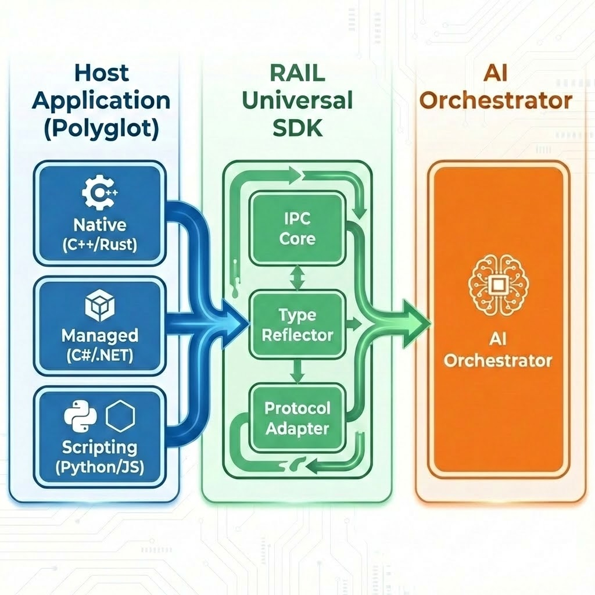
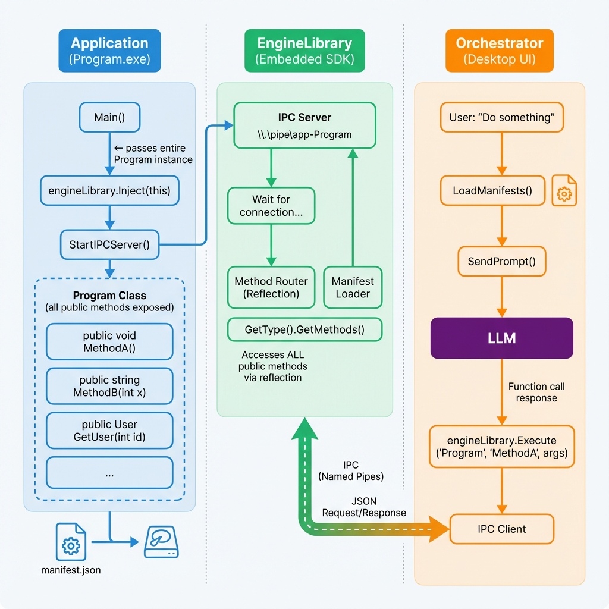

# RAIL (Remote Agent Invocation Layer) Protocol - Project Architecture

> **One line of code to make any application AI-controllable**

---

## 1. What is RAL?

RAL is a **universal bridge** that connects any application (C#, C++, Python, Node.js) to any LLM (GPT, Claude, Gemini). Instead of rewriting your application, you add **one line of code** and the AI can call your methods directly.

---

## 2. Projects at a Glance

| Project | Purpose | Language |
|---------|---------|----------|
| **RailOrchestrator** | Main AI application (UI + LLM routing) | C# / WPF |
| **RailBridge.Native** | Native DLL for cross-language IPC | C# (Native AOT) |
| **RailSDK.Universal** | Client SDK for .NET apps | C# (.NET Standard) |
| **RailSDK** | Analysis & manifest generation tools | C# |
| **RailSDK-Cpp** | Client SDK for C++ apps | C++ |
| **RailSDK-Python** | Client SDK for Python apps | Python |
| **RailSDK-Node** | Client SDK for Node.js apps | TypeScript |
| **RailStudio** | Visual tool for scanning/analyzing apps | C# / WPF |
| **ConvertedProjectExample** | Example applications | C# |

---

## 3. Project Details

### RailOrchestrator
**The Brain** - Main application that users interact with.

- WPF desktop application (.NET 9)
- Connects to LLMs (Gemini, OpenAI, Anthropic, Claude)
- ReAct agent loop for multi-step reasoning
- Hosts the Named Pipe server for client connections
- Manages assets (Chips) and tool routing

**Key files:**
- `Services/Host/HostService.cs` - Named Pipe server
- `Services/LLMService.cs` - LLM API integration
- `Services/ReAct/ReActOrchestrator.cs` - Agent loop

---

### RailBridge.Native
**The Bridge** - Native DLL that enables cross-language communication.

- Compiled with Native AOT for C-ABI compatibility
- Exposes functions callable from any language:
  - `RAIL_Ignite()` - Connect to host
- Uses Named Pipes for IPC

**Target:** Python, C++, Node.js, Rust, Go

---

### RailSDK.Universal
**The .NET SDK** - Client library for C# applications.

- .NET Standard 2.0 (compatible with .NET Framework 4.6.1+)
- Simple API: `RailEngine.Ignite(this)`
- Auto-discovers methods via reflection
- Loads `RailBridge.dll` for communication

**Usage:**
```csharp
// In App.xaml.cs
RailEngine.Ignite(this);
```

---

### RailSDK (RailFactory.Core)
**The Toolkit** - Assembly scanning and manifest generation.

Contains:
- `RuntimeRegistry` - Detect .NET / Native binaries
- `AssemblyScanner` - Extract methods from DLLs
- `CompositeManifest` - Multi-module manifest format
- `DependencyAnalyzer` - Analyze project dependencies
- `SolutionScanner` - Scan entire .sln solutions

**Used by:** RailStudio, RailOrchestrator

---

### RailSDK-Cpp
**The C++ SDK** - Enable C++ applications to connect.

- CMake-based build system
- Loads `RailBridge.dll` via `LoadLibrary`
- Callback-based command execution
- Supports both x64 and x86 builds

**Build:**
```batch
build_x64.bat   # 64-bit
build_x86.bat   # 32-bit (legacy apps)
```

**Usage:**
```cpp
Rail::ignite("MyApp", manifestJson, onCommand);
```

---

### RailSDK-Python
**The Python SDK** - Enable Python scripts to connect.

- Uses `ctypes` to load `RailBridge.dll`
- Decorator-based method registration
- Simple API matching other SDKs

**Usage:**
```python
from rail import RailEngine

engine = RailEngine()
engine.ignite([MyService()])
```

---

### RailSDK-Node (Never tested)
**The Node.js SDK** - Enable TypeScript/JavaScript apps to connect.

- Uses `ffi-napi` for native bridge access
- TypeScript types included
- Promise-based API

**Usage:**
```typescript
import { RailEngine } from 'rail-sdk';
engine.ignite([new MyService()]);
```

---

### RailStudio
**The Visual Tool** - Scan and analyze applications.

- EXE/DLL to analyzer
- Auto-generates `rail.manifest.json`
- Visualizes dependencies
- Solution-wide scanning

**Use case:** Preparing legacy apps for Rail integration

---

### ConvertedProjectExample
Example applications showing SDK integration.

| Example | Description |
|---------|-------------|
| `AgentTest` | Simple WPF app with customer database |
| `WorkflowDemo` | Workflow automation example |

**Manifest** Here you can find Manifest folder with all the "rail.manifest.json" already created for this example application

---

## 4. SDK Requirements for Developers

When converting your application to be AI-controllable, here's exactly what you need:

### Requirements by Language

| Language | What to Add | Automatically Included | Notes |
|----------|-------------|------------------------|-------|
| **C# (.NET)** | `RailSDK.Universal.dll` | `RailBridge.dll` (auto-copied) | One reference, everything included |
| **C++ (Modern)** | `rail_sdk.dll` + `RailBridge.dll` | — | RTTR reflection, auto method discovery |
| **C++ (Legacy)** | `rail_sdk.dll` + `RailBridge.dll` | — | Custom dispatcher, manual routing |
| **Python** | `RailBridge.dll` + `rail` package | — | Load via `ctypes` |
| **Node.js** | `RailBridge.dll` + `rail-sdk` npm | — | Load via `ffi-napi` |

---

### C# Developers: One Reference Does It All

When you add `RailSDK.Universal`, the native bridge is **automatically copied** to your output:

```
📁 bin/Debug/net8.0/
├── YourApp.exe
├── RailSDK.Universal.dll   ← You add this reference
├── RailBridge.dll          ← Copied automatically!
└── rail.manifest.json      ← You create this
```

**How to add:**
```xml
<PackageReference Include="RailSDK.Universal" Version="2.0.0" />
```

---

### C++ Developers: Two Options

C++ has **two integration modes** depending on your codebase:

#### Option A: Modern C++ with RTTR (Automatic Reflection)

For **new applications** or codebases that support C++17:

```cpp
// Register your classes with RTTR macros
RTTR_REGISTRATION {
    rttr::registration::class_<OrderManager>("OrderManager")
        .method("CreateOrder", &OrderManager::CreateOrder);
}

// SDK auto-discovers methods
rail::RegisterInstance("OrderManager", &myManager);
rail::Ignite("MyApp");
```

**Files needed:**
```
📁 YourApp/
├── YourApp.exe
├── rail_sdk.dll            ← C++ wrapper (includes RTTR)
├── RailBridge.dll          ← Native IPC bridge
└── rail.manifest.json      ← Auto-generated
```

#### Option B: Legacy C++ with Custom Dispatcher (Manual Routing)

For **legacy applications** that can't use C++17 or RTTR (e.g., games, old codebases):

```cpp
#define RAIL_NO_RTTR  // Disable RTTR

// Define your own command router
std::string MyDispatcher(const std::string& json) {
    if (json.find("MovePlayer") != std::string::npos) {
        MovePlayer();
        return "{\"result\": \"success\"}";
    }
    return "{\"error\": \"unknown\"}";
}

// Register and connect
rail::SetCustomDispatcher(MyDispatcher);
rail::Ignite("MyLegacyApp", "1.0", customManifest);
```

**Files needed:**
```
📁 YourApp/
├── YourApp.exe
├── rail_sdk.dll            ← C++ wrapper (no RTTR)
├── RailBridge.dll          ← Native IPC bridge
└── rail.manifest.json      ← You write this manually
```

> **Real Examples:** Notepad++ and Doom were integrated using Option B (Custom Dispatcher) because their codebases couldn't support RTTR.

---

### Python/Node.js Developers

```
📁 YourProject/
├── main.py (or index.ts)
├── RailBridge.dll          ← Copy manually
└── rail.manifest.json      ← You create this
```

Install the wrapper package that handles ctypes/ffi calls for you.

---

## 5. How Projects Connect

<p align="center">
  
</p>

### Architecture Workflow

<p align="center">
  
</p>

```
┌─────────────────────────────────────────────────────────────┐
│                    RailOrchestrator                       │
│                    (Main AI Application)                    │
│                                                             │
│  ┌─────────────┐    ┌─────────────┐    ┌───────────────┐   │
│  │  LLM APIs   │    │ HostService │    │ AssetService  │   │
│  │  (Gemini,   │    │ (Named Pipe │    │ (Chip/Manifest│   │
│  │   OpenAI)   │    │   Server)   │    │   Discovery)  │   │
│  └──────┬──────┘    └──────┬──────┘    └───────────────┘   │
└─────────┼──────────────────┼────────────────────────────────┘
          │                  │
          │         Named Pipe: "RailHost"
          │                  │
    ┌─────┴──────────────────┴─────────────────────┐
    │               RailBridge.Native            │
    │            (C-ABI Native DLL)                │
    └──────────────────┬───────────────────────────┘
                       │
       ┌───────────────┼───────────────┐
       │               │               │
┌──────▼──────┐ ┌──────▼──────┐ ┌──────▼──────┐
│ RailSDK   │ │ RailSDK   │ │ RailSDK   │
│ .Universal  │ │ -Cpp        │ │ -Python     │
│ (C# Apps)   │ │ (C++ Apps)  │ │ (Python)    │
└──────┬──────┘ └──────┬──────┘ └──────┬──────┘
       │               │               │
┌──────▼──────┐ ┌──────▼──────┐ ┌──────▼──────┐
│  Your C#   │ │  Your C++  │ │ Your Python │
│    App     │ │    App     │ │   Script    │
└─────────────┘ └─────────────┘ └─────────────┘
```

### Dependency Flow:

```
RailOrchestrator
    └── uses → RailSDK (RailFactory.Core) for manifest parsing
    
RailSDK.Universal
    └── loads → RailBridge.Native (DLL)
    
RailSDK-Cpp / RailSDK-Python / RailSDK-Node
    └── load → RailBridge.Native (DLL)

RailStudio
    └── uses → RailSDK (RailFactory.Core) for scanning
```

---

## 6. Usage Examples

### Example 1: Make a C# App AI-Controllable

```csharp
// 1. Create your service
public class CustomerService
{
    public Customer GetCustomer(int id) => Database.Find(id);
    public void CreateCustomer(string name, string email) { ... }
}

// 2. Add one line in App.xaml.cs
protected override void OnStartup(StartupEventArgs e)
{
    base.OnStartup(e);
    RailEngine.Ignite(this);
}

// 3. Create rail.manifest.json (or use RailStudio)
```

### Example 2: Control a C++ Application

```cpp
// Define callback
const char* OnCommand(const char* json) {
    auto cmd = ParseJson(json);
    if (cmd.method == "MoveMachine") {
        Machine::Move(cmd.args["x"], cmd.args["y"]);
        return R"({"result": "OK"})";
    }
    return R"({"error": "Unknown"})";
}

// Connect
rail::ignite("CNCController", manifest, OnCommand);
```

### Example 3: Python Script Integration

```python
class DataProcessor:
    def analyze_data(self, file_path: str) -> dict:
        return {"rows": 1000, "status": "processed"}

engine = RailEngine()
engine.ignite([DataProcessor()])
engine.wait()
```

### Example 4: Ask AI to Execute

With apps connected, ask in natural language:

```
"Create a customer named John Smith with email john@example.com"
→ AI calls CustomerService.CreateCustomer("John Smith", "john@example.com")

"Move the machine to position X=100, Y=200"
→ AI calls CNCController.MoveMachine(100, 200)
```

---

## Quick Start

1. **Run RailOrchestrator** - The main AI interface
2. **Connect your app** - Add SDK and call `Ignite()`
3. **Ask AI** - Natural language commands execute your code

---

<p align="center">
<b>RAIL Protocol</b> - Bridging Legacy Applications and AI
</p>


